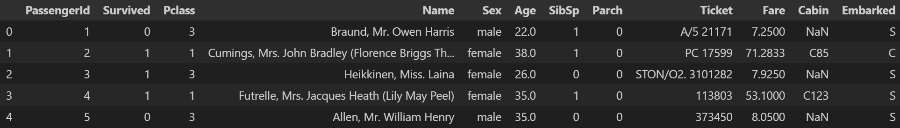
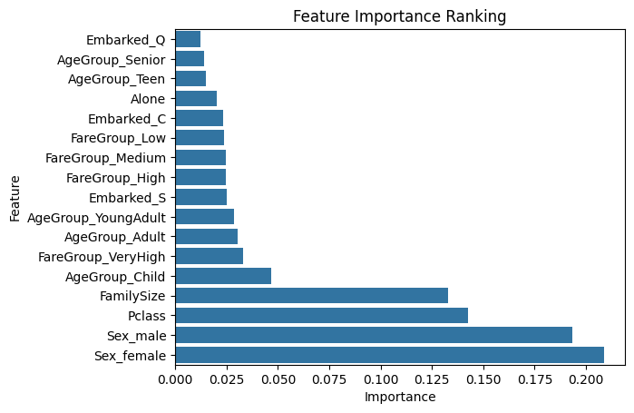
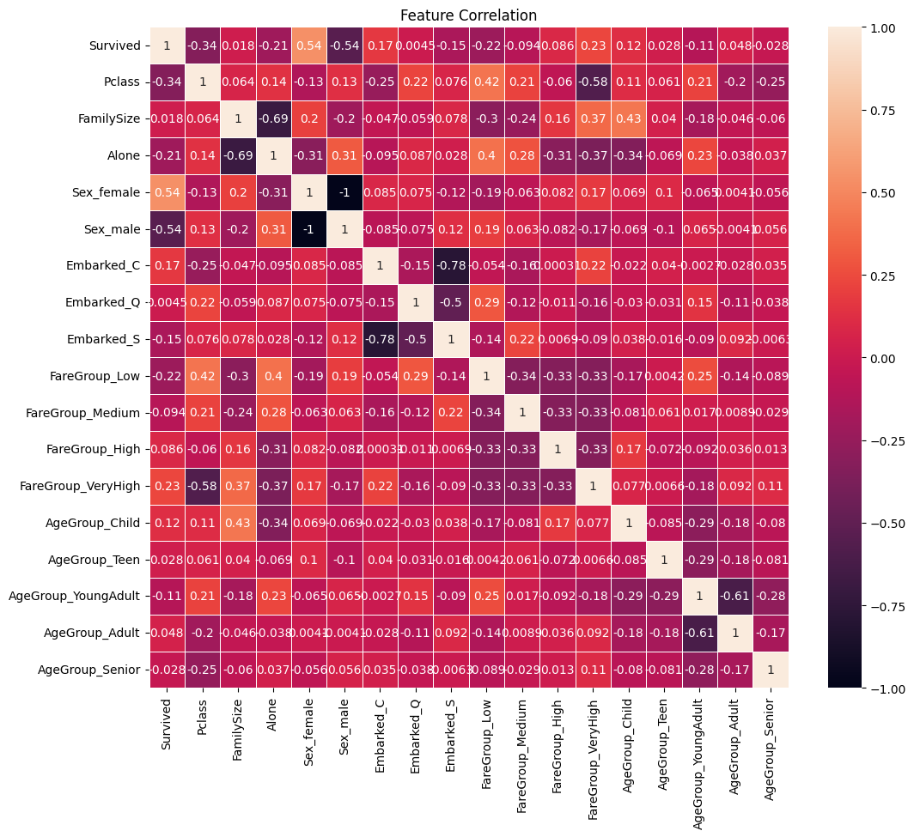
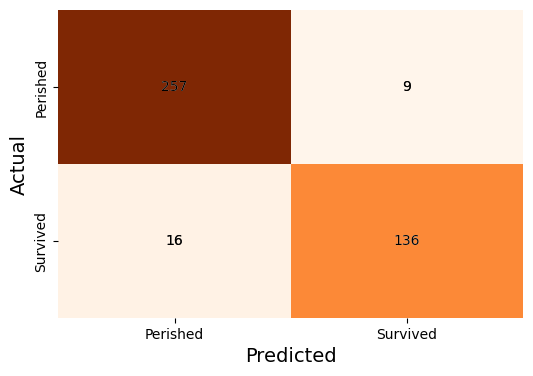
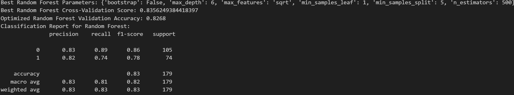

# Titanic - Machine Learning From Disaster competition submission
https://www.kaggle.com/c/titanic

---

## 📌 Project Overview
The Titanic challenge is a classic binary classification problem. The goal is to predict which passengers survived the shipwreck based on data like age, gender, and socio-economic class.

## Data Preview

## Data Analysis

## Results

